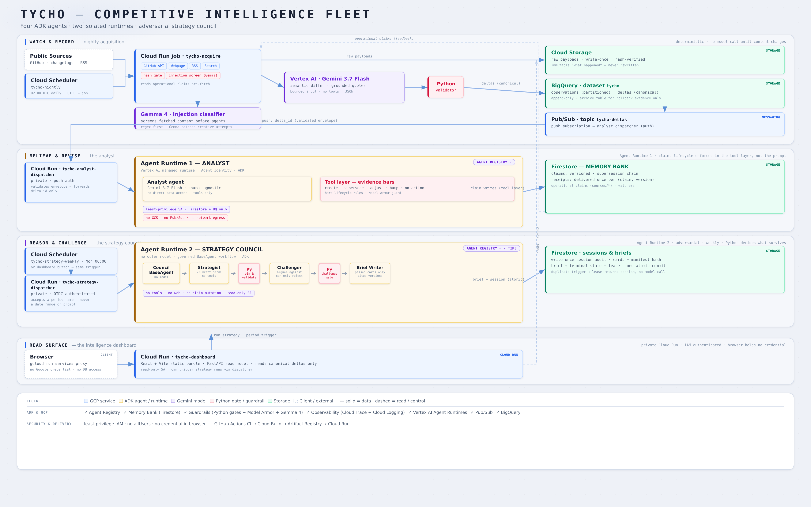

# Tycho

> An autonomous competitive-intelligence fleet that accumulates evidence, revises versioned beliefs, and refuses conclusions it cannot support.

[](https://github.com/nihsett/tycho/actions/workflows/ci.yml)
[](LICENSE)
[](pyproject.toml)

[**Live dashboard**](https://tycho-dashboard-u2s544lf5a-uc.a.run.app) · [Devpost project](https://devpost.com/software/tycho-1xekyg) · [Architecture](docs/architecture.md) · [Production evidence](docs/strategic-agent-fleet-evidence.org)



## What Tycho does

Competitive intelligence is an ongoing evidence problem, not a one-shot search. Tycho watches the same entities over time, separates durable changes from release churn, and maintains a governed belief model in which every claim points back to immutable source evidence.

The deployed demonstration market is coding agents:

- Claude Code
- OpenAI Codex
- Gemini CLI
- Pi

Each entity is configured in [`tycho.yaml`](tycho.yaml), together with its official sources, ontology branches, staleness rules, and schedules. The production demo watches eight channels: GitHub releases and official changelogs for all four products.

The fleet runs without a chat prompt:

1. **Watch and record.** Cloud Scheduler starts a Cloud Run acquisition job. Raw payloads are written once to Cloud Storage and immutable Observations are appended to BigQuery.
2. **Interpret changes.** A hash gate stops unchanged content. Changed pairs go to Gemini 3.7 Flash through Vertex AI; Python verifies every quote, ID, enum, bound, and policy rule before storing a canonical `Delta@2`.
3. **Believe and revise.** The managed Tycho Analyst Runtime turns meaningful Deltas into versioned Firestore claims through five governed tools. Claims are superseded, never silently overwritten.
4. **Reason and challenge.** A separate weekly Strategy Council Runtime drives a Strategist, Challenger, and Brief Writer over exact pinned claim versions. Python gates run between every role.
5. **Explain.** The dashboard resolves a belief or conclusion to its claim version, canonical Delta, grounded quote, and before/after Observation IDs.

## Why it is different

| | Scraper or summarizer | Tycho |
|---|---|---|
| Evidence | Reads the latest page | Preserves immutable before/after Observations |
| Change detection | Text diff or fresh summary | Grounded semantic Delta with exact quotes |
| Memory | Replaces the previous summary | Versions and supersedes evidenced claims |
| Contradiction | Quietly changes the answer | Records disputes until stronger evidence resolves them |
| Strategy | Produces plausible prose | Requires independent premises and adversarial challenge |
| Weak evidence | Usually still answers | Publishes an explicit empty brief |

The latest autonomous weekly session demonstrated that last property. It pinned 23 exact claim versions, made one Gemini call, rejected the proposed market conclusion for failing evidence rules, and wrote an empty brief rather than manufacture a pattern. Repeating the same period returned the existing Firestore-leased session without a second model call.

## Durable knowledge model

Every entity uses the same fixed ontology:

```text
Entity
├── Identity
├── Product
│   ├── Capabilities
│   └── Roadmap
├── Pricing
├── Go to market
├── Team
├── Traction
└── Sources

Claim ID → version → evidence → supersession history
```

Firestore is deliberately the authoritative belief ledger instead of conversational memory. Tycho needs exact versions, transactions, evidence references, and lifecycle invariants. BigQuery and Cloud Storage remain the immutable evidence plane.

## Google Cloud and agent platform

- **Google ADK** for the Analyst, Strategist, Challenger, and Brief Writer
- **Gemini on Vertex AI** for semantic change interpretation and agent reasoning
- **Gemma** at the acquisition boundary for semantic prompt-injection screening
- **Two managed Agent Runtimes**, automatically cataloged in **Agent Registry**
- Separate managed **Agent Identities** and least-privilege IAM
- **Cloud Run** for acquisition, bounded dispatchers, and the dashboard
- **Cloud Scheduler** for nightly acquisition and the weekly council
- **BigQuery + Cloud Storage** for immutable evidence
- **Firestore** for versioned claims, sessions, briefs, transactions, and leases
- **Pub/Sub** for authenticated meaningful-Delta delivery
- **Cloud Trace + OpenTelemetry** for structural telemetry with governed prose removed before export

The model identifier used by every production run is persisted with that run. Gemini 3.7 Flash is the semantic differ and current code default; the recorded 31 August Strategy Council run used `gemini-3.5-flash-lite`.

## Production snapshot

As of 31 August 2026, the public dashboard reads real Google Cloud state:

- 8 official source watchers
- 132 immutable Observations
- 79 canonical Deltas: 25 meaningful and 54 noise
- 23 active verified claims
- 4 monitored entities
- Latest weekly result: 1 card proposed, 1 rejected, 0 published

The dashboard is public for judging. Its service identity has read-only data roles, cannot read raw Cloud Storage payloads, and cannot write claims or Deltas. Its only write-shaped action is a fixed `previous_complete_week` Strategy Council request to a private dispatcher. The browser cannot supply a prompt, date range, model, scope, or policy, and duplicate periods resolve through the durable lease.

## Quick start

Prerequisites:

- Python 3.13
- [`uv`](https://docs.astral.sh/uv/)
- [`just`](https://just.systems/)

```bash
git clone https://github.com/nihsett/tycho.git
cd tycho
just setup
just check
```

`just check` is offline: lock validation, Ruff, byte compilation, and 488 Python tests. It needs no Google Cloud credential and makes no model call.

Run a local acquisition cycle against the configured public sources:

```bash
just local-github
just local-web
just local-stats
```

The first cycle establishes baselines. Later cycles append observations and Deltas to the local SQLite store and retain write-once raw payloads under the gitignored `data/` directory.

Run the synthetic Strategy Council locally:

```bash
just strategy-session
just strategy-brief
just strategy-stats
```

This local scenario is deterministic and offline. It uses a disposable store and makes no Gemini or Google Cloud call.

### Dashboard development

```bash
just dashboard-install
just dashboard-test-ui
just dashboard-build
```

The frontend is React, TypeScript, and Vite. The API is FastAPI with typed bounded responses, same-origin write protection, CSP/security headers, and structural logs.

## Safety boundaries

Tycho does not rely on prompts as its security boundary:

- Scraped text is untrusted data and can be quarantined before reaching an agent.
- Models cannot write directly to BigQuery, Cloud Storage, or Firestore.
- The Analyst can act only through five lifecycle tools whose Python implementations enforce evidence rules.
- The Strategy Council cannot browse, search, read raw snapshots, or mutate claims.
- Cross-market conclusions need at least two entities and two independent source families.
- Mirrored evidence from one vendor counts as one witness.
- A Challenger can reject a card but cannot revive one that failed a hard rule.
- Runtime traces retain structure and usage while prompts, model responses, claim text, and source quotes are removed before export.
- Delivery and strategy execution are idempotent through transactional leases.

Production deployment tools require interactive confirmation, persist resumable state, and read resources back from Google Cloud instead of trusting command success. The dashboard deployment defaults to private; the live judging instance has a separately granted public invoker binding.

## Repository map

```text
adapters/          Generic source adapters
pipeline/          Acquisition, semantic differ, claims, strategy context
runtime_agent/     Managed Analyst Runtime wrapper and telemetry
strategy_agent/    Strategy Council Runtime and ADK agents
schemas/           Versioned data contracts
dashboard/         FastAPI read model and React frontend
infra/             Guarded, resumable Google Cloud deployment tools
tests/             Offline backend regression suite
docs/              Specification, architecture, and production evidence
video/             Final narration, cue card, and generation tooling
```

Useful documents:

- [`docs/tycho-spec.org`](docs/tycho-spec.org) — product and data contract
- [`docs/architecture.md`](docs/architecture.md) — detailed runtime architecture
- [`docs/strategic-agent-fleet-evidence.org`](docs/strategic-agent-fleet-evidence.org) — Strategy Council resources, IAM, sessions, and telemetry
- [`docs/agent-runtime-production-evidence.org`](docs/agent-runtime-production-evidence.org) — Analyst Runtime evidence
- [`docs/semantic-delta-deployment-evidence.org`](docs/semantic-delta-deployment-evidence.org) — semantic Delta production evidence
- [`docs/intelligence-dashboard-evidence.org`](docs/intelligence-dashboard-evidence.org) — dashboard read model, IAM, and verification

Run `just` to list every local, inspection, and deployment recipe.

## License

Apache-2.0. See [`LICENSE`](LICENSE).
